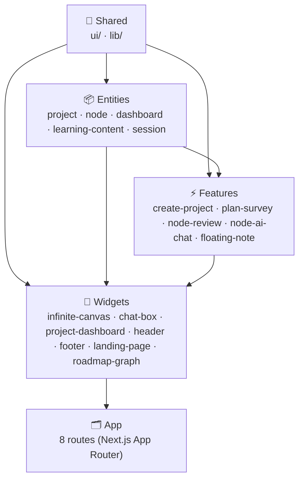

# Kiến trúc FSD — OmiLearn

> Tài liệu tổng quan về các tầng trong kiến trúc Feature-Sliced Design của OmiLearn.

---

## Các tầng kiến trúc

## Tài liệu từng tầng

| Tầng | Mô tả | Link |
|------|-------|------|
| **Entities** | Business entities: types, mock data, UI atoms | [entities.md](entities.md) |
| **Features** | User interactions: modals, flows, actions | [features.md](features.md) |
| **Widgets** | Composite blocks: canvas, dashboard, chat | [widgets.md](widgets.md) |
| **Shared** | Atomic infrastructure: UI primitives, utils | [shared.md](shared.md) |

> [!NOTE]
> Import chỉ được đi từ tầng cao xuống tầng thấp. Không cross-import cùng tầng.
