# Database Architecture — OmiLearn

> Schema microservice: 5 database độc lập theo nguyên tắc Database-per-Service.

---

## Tổng quan

Hệ thống sử dụng **5 PostgreSQL database** riêng biệt, mỗi database thuộc sở hữu của 1 service. Không có FK (foreign key) xuyên database — chỉ lưu UUID reference.

```mermaid
flowchart TD
    subgraph authDB ["auth_db (port 5433)"]
        users["users"]
        refresh_tokens["refresh_tokens"]
    end

    subgraph learningDB ["learning_db (port 5434)"]
        direction LR
        subgraph d1 [Domain 1 - Projects]
            projects["projects"]
            project_members["project_members"]
            plan_survey["plan_survey_responses"]
        end
        subgraph d2 [Domain 2 - Documents]
            project_docs["project_documents"]
        end
        subgraph d3 [Domain 3 - Roadmap]
            roadmaps["roadmaps"]
            roadmap_nodes["roadmap_nodes"]
            learning_nodes["learning_nodes"]
            content_nodes["content_nodes"]
        end
        subgraph d4 [Domain 4 - Learning]
            cn_chats["content_node_chats"]
            asset_sug["node_asset_suggestions"]
            learn_sessions["learning_sessions"]
            topic_progress["topic_progress"]
            node_ai_reviews["node_ai_reviews"]
            quiz_attempts["quiz_attempts"]
            fc_attempts["flashcard_attempts"]
            essay_attempts["essay_attempts"]
            teach_attempts["teach_ai_attempts"]
        end
        subgraph d5 [Domain 5 - Schedule]
            cal_conn["calendar_connections"]
            sched_entries["schedule_entries"]
        end
        subgraph d6 [Domain 6 - Analytics]
            skill_snap["skill_snapshots"]
        end
        subgraph d7 [Realtime Chat]
            chat_rooms["chat_rooms"]
            chat_members["chat_members"]
            chat_messages["chat_messages"]
        end
    end

    subgraph aiDB ["ai_db (port 5435)"]
        ai_logs["ai_generation_logs"]
        gen_plans["generated_plans"]
        ai_roadmap_gen["ai_roadmap_generations"]
        ai_eval["ai_evaluation_results"]
        doc_sug["doc_suggestions"]
        prompts["prompt_templates"]
    end

    subgraph teacherDB ["teacher_db (port 5436)"]
        courses["courses"]
        course_units["course_units"]
        course_resources["course_resources"]
        roadmap_templates["roadmap_templates"]
        template_nodes["template_nodes"]
        template_edges["template_edges"]
        student_progress["student_progress"]
    end

    subgraph adminDB ["admin_db (port 5437)"]
        system_stats["system_stats"]
        daily_stats["daily_stats"]
        activity_logs["activity_logs"]
        course_stats["course_stats"]
        teacher_stats["teacher_stats"]
        system_settings["system_settings"]
        admin_ai_chats["admin_ai_chats"]
        announcements["announcements"]
    end

    users -->|"UUID ref"| projects
    projects -->|"ProjectCreated event"| activity_logs
    projects -->|"UUID ref"| gen_plans
    projects -->|"UUID ref"| ai_roadmap_gen
    node_ai_reviews -->|"UUID ref"| ai_eval
    roadmap_nodes -->|"UUID ref"| doc_sug
    topic_progress -->|"TopicCompleted event"| system_stats
    quiz_attempts -->|"AttemptCompleted event"| ai_eval
```



## Service — Database mapping

| Service | Database | Port | Số bảng | Vai trò |
|---------|----------|------|---------|---------|
| Auth Service | `auth_db` | 5433 | 2 | User accounts, JWT, RBAC |
| Learning Service | `learning_db` | 5434 | 23 | Projects, documents, roadmap (tree), learning content (3-tier), AI review + 4 attempt types, progress, schedule, analytics, realtime chat |
| AI Service | `ai_db` | 5435 | 6 | AI generation logs, study plans, roadmap generation, skill evaluation, doc suggestions, prompt management |
| Teacher Service | `teacher_db` | 5436 | 7 | Courses, resources, roadmap templates, student progress |
| Admin Service | `admin_db` | 5437 | 8 | System stats, activity logs, course/teacher analytics, settings, announcements |

## 1. auth_db — Auth Service

| Bảng | Mô tả |
|------|-------|
| `users` | Tài khoản, email, password hash, role (student/teacher/admin) |
| `refresh_tokens` | JWT refresh token per device |

Schema file: [`db/auth/init.sql`](../../../db/auth/init.sql)

## 2. learning_db — Learning Service

| Domain | Bảng | Mô tả |
|--------|------|-------|
| Projects | `projects` | Dự án học tập, mỗi card trên Project Hub |
| Projects | `project_members` | Cộng tác B2B (owner/editor/viewer) |
| Projects | `plan_survey_responses` | Khảo sát Quick Check-in trước khi tạo roadmap |
| Documents | `project_documents` | Metadata file upload (file thật trong MinIO) |
| Roadmap | `roadmaps` | 1 roadmap per project |
| Roadmap | `roadmap_nodes` | Tree structure (parent_id), topic nodes trên mind map |
| Roadmap | `learning_nodes` | Tầng 2: sub-topic bên trong leaf roadmap node |
| Roadmap | `content_nodes` | Tầng 3: nội dung video/pdf gắn vào learning_node |
| Learning | `content_node_chats` | Chat AI gắn với từng content_node |
| Learning | `node_asset_suggestions` | Tài liệu gợi ý chưa upload (staging area) |
| Learning | `learning_sessions` | Phiên học tập, invite bạn bè cùng học |
| Learning | `topic_progress` | Tiến độ 4 chiều (analysis/synthesis/critique/interview) |
| Review | `node_ai_reviews` | Phiên ôn tập AI per content_node (bảng cha cho 4 loại attempt) |
| Review | `quiz_attempts` | Lịch sử trắc nghiệm (FK -> node_ai_reviews) |
| Review | `flashcard_attempts` | Lịch sử flashcard (FK -> node_ai_reviews) |
| Review | `essay_attempts` | Lịch sử tự luận + AI chấm (FK -> node_ai_reviews) |
| Review | `teach_ai_attempts` | Lịch sử "Dạy AI" + AI đánh giá (FK -> node_ai_reviews) |
| Schedule | `calendar_connections` | OAuth token Google/Outlook Calendar |
| Schedule | `schedule_entries` | Slot học tập trên lịch tuần |
| Analytics | `skill_snapshots` | Điểm kỹ năng 4 chiều theo thời gian |
| Chat | `chat_rooms` | Chat room gắn với learning session |
| Chat | `chat_members` | Thành viên room (user_name denormalized) |
| Chat | `chat_messages` | Tin nhắn (user_name denormalized) |

**Cấu trúc nội dung + ôn tập:**
```
roadmap_nodes (topic tree trên mind map)
  └── learning_nodes (sub-topics bên trong leaf node)
       └── content_nodes (video/pdf gắn vào sub-topic)
            ├── content_node_chats (AI chat per content)
            └── node_ai_reviews (phiên ôn tập AI)
                 ├── quiz_attempts
                 ├── flashcard_attempts
                 ├── essay_attempts
                 └── teach_ai_attempts
```

Schema file: [`db/learning/init.sql`](../../../db/learning/init.sql)

## 3. ai_db — AI Service

AI Service là **stateless processor** — nhận request, gọi LLM, trả kết quả. Dữ liệu học tập (attempts, chat, progress) nằm hoàn toàn trong learning_db. ai_db chỉ lưu lịch sử request/response, AI outputs phức tạp, và prompt templates.

| Nhóm | Bảng | Mô tả |
|------|------|-------|
| Logs | `ai_generation_logs` | Log MỌI request đến AI service (usage, cost, I/O, debugging) |
| Plan | `generated_plans` | AI tạo study plan từ survey (ref project_id) |
| Roadmap | `ai_roadmap_generations` | AI generate roadmap từ documents + survey (input/output audit) |
| Evaluation | `ai_evaluation_results` | AI đánh giá kỹ năng 4 chiều sau attempt (scores + reasoning) |
| Doc Suggest | `doc_suggestions` | AI gợi ý tài liệu per roadmap_node |
| Prompts | `prompt_templates` | Versioned prompt management per feature |

Schema file: [`db/ai/init.sql`](../../../db/ai/init.sql)

> - Vector embeddings được lưu riêng trong Qdrant/FAISS, không nằm trong PostgreSQL.
> - Quiz/flashcard/essay/teach content được inline trong learning_db (JSONB trong `*_attempts.answers`/`.cards`). ai_db không lưu generated content riêng.
> - `ai_evaluation_results` lưu chi tiết reasoning (tại sao AI cho điểm X), khác với `skill_snapshots` trong learning_db chỉ lưu score number.

## 4. teacher_db — Teacher Service

| Bảng | Mô tả |
|------|-------|
| `courses` | Khóa học (teacher_name denormalized) |
| `course_units` | Bài học trong khóa học (ordered) |
| `course_resources` | Tài liệu upload (MinIO) |
| `roadmap_templates` | Roadmap mẫu do teacher thiết kế |
| `template_nodes`, `template_edges` | Graph nodes/edges trong template |
| `student_progress` | Tiến độ từng student (student_name denormalized) |

Schema file: [`db/teacher/init.sql`](../../../db/teacher/init.sql)

## 5. admin_db — Admin Service

| Nhóm | Bảng | Mô tả |
|------|------|-------|
| Dashboard | `system_stats` | Snapshot tổng: students, teachers, courses, avg_completion |
| Dashboard | `daily_stats` | Metrics theo ngày: new_students, enrollments, quizzes, AI requests |
| Activity | `activity_logs` | Feed hoạt động gần đây (từ events tất cả service) |
| Analytics | `course_stats` | Thống kê per-course: students, units, completion, rating (denormalized) |
| Analytics | `teacher_stats` | Thống kê per-teacher: courses, students, rating (denormalized) |
| Settings | `system_settings` | Key-value config hệ thống |
| AI Chat | `admin_ai_chats` | Lịch sử chat AI trợ lý analytics cho admin |
| Communication | `announcements` | Thông báo platform-wide từ admin (target: all/student/teacher) |

Schema file: [`db/admin/init.sql`](../../../db/admin/init.sql)

> Admin Service là **read-heavy** service. Hầu hết dữ liệu được **sync từ các service khác** qua events, không phải nguồn sự thật (source of truth).

## Cross-service communication

Các service giao tiếp qua **events** (message queue) hoặc **API calls**, không truy cập trực tiếp DB của nhau.

| Event | Publisher | Subscriber | Dữ liệu |
|-------|-----------|------------|----------|
| `UserCreated` | Auth | All services | user_id, name, role |
| `UserUpdated` | Auth | All services | name, avatar (cập nhật denormalized fields) |
| `ProjectCreated` | Learning | Admin | project_id, owner_id, name |
| `RoadmapGenerated` | AI | Learning, Admin | project_id, roadmap_id, nodes_output |
| `AttemptCompleted` | Learning | AI | user_id, review_id, attempt_type, attempt_id, attempt data |
| `EvaluationCompleted` | AI | Learning, Admin | user_id, review_id, 4-dimension scores |
| `TopicCompleted` | Learning | AI, Admin | user_id, roadmap_node_id, 4-dimension scores |
| `CoursePublished` | Teacher | Learning, Admin | course_id, title, teacher_name |
| `CourseUpdated` | Teacher | Learning, Admin | course units, roadmap template |
| `StudentEnrolled` | Learning | Teacher, Admin | student_id, student_name, course_id |
| `ProgressUpdated` | Learning | Teacher, Admin | student_id, course_id, completion % |
| `ResourceUploaded` | Teacher | AI | file metadata → create embeddings |
| `*` (all events) | All | Admin | → activity_logs + daily_stats aggregation |

## Cross-service UUID references

Các field tham chiếu xuyên service (không có FK, chỉ lưu UUID):

| Field | Nguồn gốc | Sử dụng tại |
|-------|-----------|-------------|
| `user_id` / `owner_id` | `auth_db.users.user_id` | Hầu hết các bảng trong learning_db, ai_db |
| `project_id` | `learning_db.projects.id` | `ai_db.generated_plans`, `ai_db.ai_roadmap_generations` |
| `roadmap_node_id` | `learning_db.roadmap_nodes.id` | `ai_db.doc_suggestions` |
| `review_id` | `learning_db.node_ai_reviews.id` | `ai_db.ai_evaluation_results` |
| `attempt_id` | `learning_db.*_attempts.id` | `ai_db.ai_evaluation_results` |
| `reference_id` | various learning_db tables | `ai_db.ai_generation_logs` (polymorphic ref) |

## Denormalized fields

Một số field được **copy** sang service khác để tránh API call liên tục:

| Field | Nguồn gốc | Copy tại |
|-------|-----------|----------|
| `user_name` | `auth_db.users.name` | `learning_db.chat_members`, `learning_db.chat_messages`, `admin_db.activity_logs` |
| `teacher_name` | `auth_db.users.name` | `teacher_db.courses`, `admin_db.course_stats`, `admin_db.teacher_stats` |
| `student_name` | `auth_db.users.name` | `teacher_db.student_progress` |
| `course_title` | `teacher_db.courses.title` | `admin_db.course_stats` |

Khi user đổi tên → Auth publish `UserUpdated` event → các service cập nhật bản sao.

## Chạy local

```bash
# Khởi động tất cả databases + Redis + MinIO
docker compose up -d

# Kiểm tra trạng thái
docker compose ps

# Kết nối từng DB
psql -h localhost -p 5433 -U auth_user -d auth_db
psql -h localhost -p 5434 -U learning_user -d learning_db
psql -h localhost -p 5435 -U ai_user -d ai_db
psql -h localhost -p 5436 -U teacher_user -d teacher_db
psql -h localhost -p 5437 -U admin_user -d admin_db
```

Xem thêm: [`docker-compose.yml`](../../../docker-compose.yml) và [`.env.example`](../../../.env.example)
