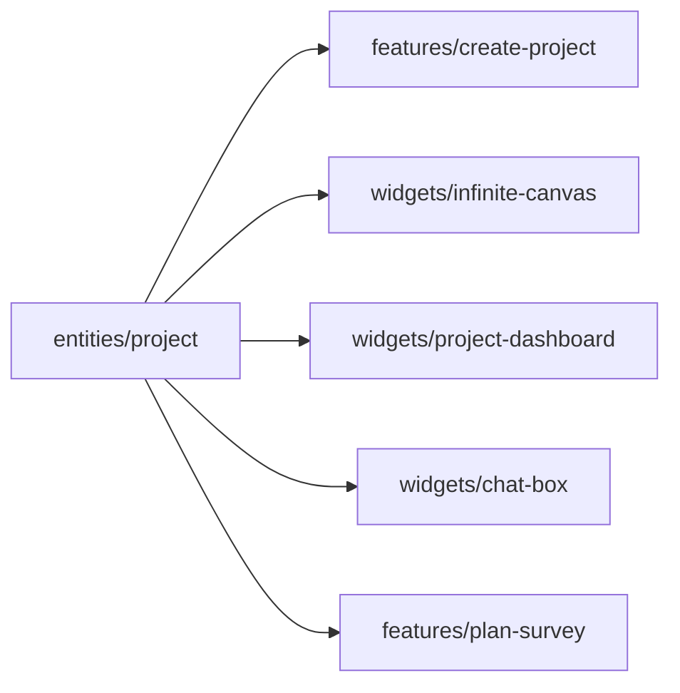
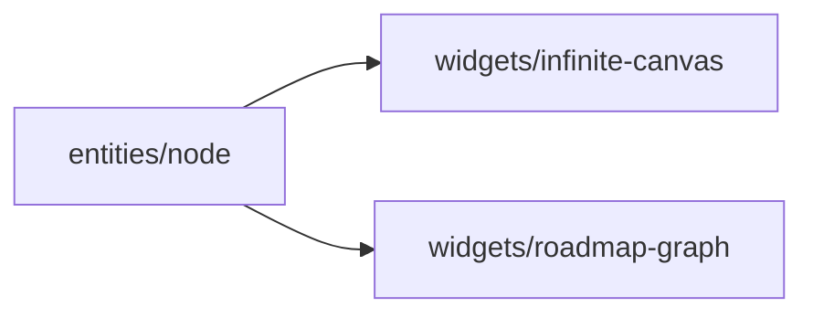
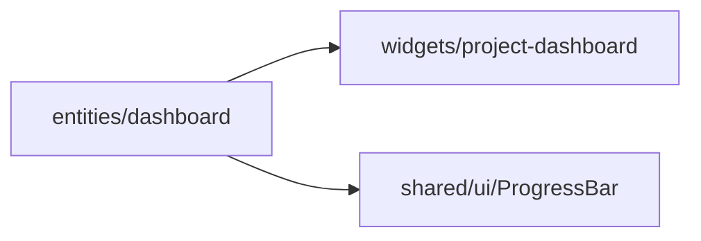
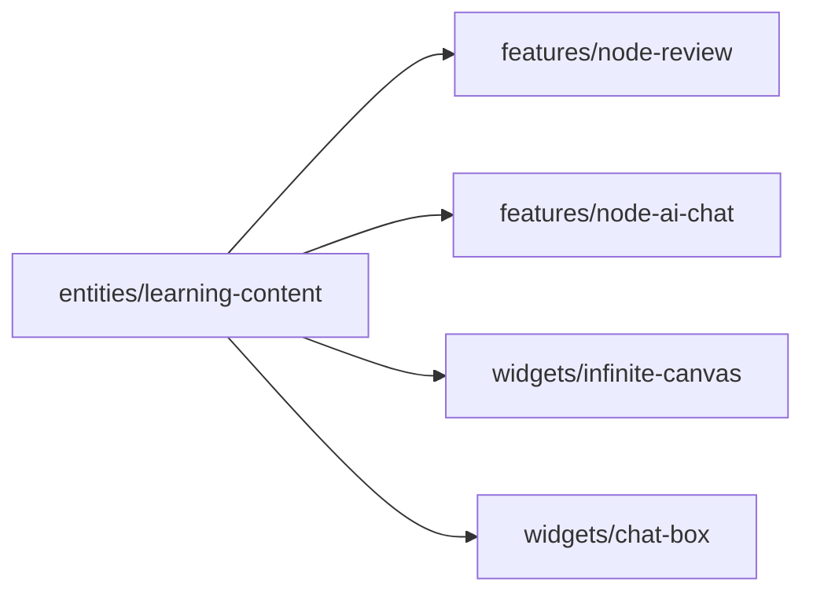
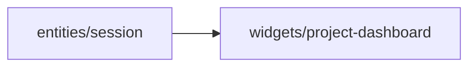

# Tầng Entities — OmiLearn

> Tầng thấp nhất trong FSD (trừ shared). Định nghĩa các business entity: types, mock data, UI atoms.

---

## 1. Tổng quan

Tầng `entities/` chứa 5 slice:

| Slice | Mô tả |
|-------|-------|
| `project` | Dự án học tập, thành viên, store Zustand |
| `node` | Canvas node types, visual styles, UI atoms |
| `dashboard` | Thống kê tiến độ, phiên học |
| `learning-content` | Tài liệu, quiz, flashcard, chat AI |
| `session` | Phiên học tập |

Mỗi slice có cấu trúc:
```
entities/<slice>/
├── model/
│   └── types.ts     # Interface definitions
├── data/
│   └── mock.ts      # Mock data
├── ui/              # UI atoms (nếu có)
│   └── *.tsx
└── index.ts         # Public API
```

---

## 2. Entity: `project`

### 2.1 Mục đích

Quản lý dự án học tập của người dùng. Đây là entity trung tâm của ứng dụng — mọi canvas, dashboard và lộ trình đều gắn với một Project.

### 2.2 Interface definitions

```typescript
// entities/project/model/types.ts

export interface Project {
  id: string;
  title: string;
  description: string;
  date: string;
  progress?: number;      // 0-100, undefined nghĩa là hoàn thành
  isComplete?: boolean;
  isB2B?: boolean;        // B2B/group course flag
}

export interface ProjectMember {
  id: string;
  name: string;
  initials: string;       // Ví dụ: "MA" cho "Minh Anh"
  color: string;          // Hex color cho avatar
  role: 'owner' | 'editor' | 'viewer';
}

export interface SharedCourse {
  id: string;
  title: string;
  sharedBy: string;
  timeAgo: string;        // Ví dụ: "2 giờ trước"
}
```

### 2.3 Store Zustand

```typescript
// entities/project/model/store.ts

interface OmiLearnState {
  projects: Project[];
  currentProject: Project | null;
  isCreateModalOpen: boolean;
  isPlanModalOpen: boolean;
  hasPlan: boolean;
  // Actions
  openCreateModal: () => void;
  closeCreateModal: () => void;
  createProject: (name: string, description: string) => string; // returns id
  setCurrentProject: (id: string) => void;
  openPlanModal: () => void;
  closePlanModal: () => void;
  setPlanComplete: () => void;
}
```

### 2.4 Mock data

4 project mẫu về Khoa học máy tính:
- **Hệ Điều Hành và Linux** — progress: 65%
- **Cấu Trúc Dữ Liệu và Giải Thuật** — isComplete: true
- **Mạng Máy Tính** — progress: 40%, isB2B: true
- **Trí Tuệ Nhân Tạo** — progress: 25%

### 2.5 Sử dụng

```typescript
import { useOmiLearnStore } from '@/entities/project';
import type { Project } from '@/entities/project';
import { projects, projectMembers } from '@/entities/project';

// Trong component
const { projects, createProject, openCreateModal } = useOmiLearnStore();
```

### 2.6 Dependency diagram



---

## 3. Entity: `node`

### 3.1 Mục đích

Định nghĩa các loại node trên Infinite Canvas: types, visual styles, UI atoms. Đây là entity cốt lõi cho `infinite-canvas` widget.

### 3.2 Interface definitions

```typescript
// entities/node/model/types.ts

export interface MindMapNode {
  id: string;
  label: string;
  type: 'root' | 'child';
  expanded?: boolean;
}

export interface ContentCard {
  id: string;
  type: 'video' | 'pdf';
  title: string;
  tags: Array<{ label: string; color: 'green' | 'coral' }>;
}

export interface RoadmapNode {
  id: string;
  label: string;
  x: number;
  y: number;
}

export interface RoadmapEdge {
  id: string;
  from: string;
  to: string;
}

// Canvas node entity types
export interface CanvasNode {
  id: string;
  type: 'topic' | 'chapter' | 'document' | 'ai-response' | 'note' | 'synthesis';
  title: string;
  content?: string;
  summary?: string;
  docType?: 'text' | 'video';
  docId?: string;
  nodeId?: string;
  x: number;
  y: number;
  width: number;
  height: number;
  parentId?: string;
  color?: string;
  synthSourceIds?: string[];  // IDs của các node nguồn (dùng cho synthesis node)
}

export interface CanvasEdge {
  from: string;
  to: string;
}
```

### 3.3 Visual styles

```typescript
// entities/node/model/types.ts

export const NODE_STYLES: Record<CanvasNode['type'], {
  bg: string; border: string; textColor: string;
}> = {
  topic:         { bg: '#E8D5F5', border: '#A855F7', textColor: '#4C1D95' },
  chapter:       { bg: '#EDFAF4', border: '#3DBE7A', textColor: '#1A4731' },
  document:      { bg: '#FFFFFF', border: '#E5DDD5', textColor: '#2D2D2D' },
  'ai-response': { bg: '#EEF2FF', border: '#818CF8', textColor: '#3730A3' },
  note:          { bg: '#FFFDE7', border: '#F59E0B', textColor: '#92400E' },
  synthesis:     { bg: '#FFFFFF', border: '#A855F7', textColor: '#2D2D2D' },
};

export const EDGE_COLORS: Record<CanvasNode['type'], string> = {
  topic: '#A855F7', chapter: '#3DBE7A', document: '#818CF8',
  'ai-response': '#818CF8', note: '#F59E0B', synthesis: '#A855F7',
};
```

### 3.4 UI Components

#### `CanvasNode`

Component chính render node trên canvas.

| Prop | Type | Mô tả |
|------|------|-------|
| `node` | `CanvasNode` | Dữ liệu node |
| `isExpanded` | `boolean` | Node đang được expand (mờ đi) |
| `isFocused` | `boolean` | Node đang được focus (highlight) |
| `onDrag` | `(id, dx, dy) => void` | Callback khi kéo node |
| `onClick` | `(id) => void` | Callback khi click node |
| `onContextMenu` | `(e, node) => void` | Callback khi right-click |
| `scale` | `number` | Zoom scale hiện tại (dùng để normalize drag delta) |
| `collapsedChildCount` | `number` | Số con bị collapse (default: 0) |

#### `NodeIcon`

Icon nhỏ hiển thị trong node theo `type`:

| Prop | Type | Mô tả |
|------|------|-------|
| `type` | `CanvasNode['type']` | Loại node |
| `docType` | `'text' \| 'video'` | Loại document (chỉ khi type = 'document') |

#### `NodeBadge`

Badge hiển thị số con bị collapse:

| Prop | Type | Mô tả |
|------|------|-------|
| `count` | `number` | Số node con bị ẩn |
| `textColor` | `string` | Màu chữ (lấy từ NODE_STYLES) |

### 3.5 Mock data

7 roadmap nodes mẫu cho khóa Hệ Điều Hành với cạnh kết nối tạo thành DAG.

### 3.6 Dependency diagram



---

## 4. Entity: `dashboard`

### 4.1 Mục đích

Dữ liệu thống kê tiến độ học tập và lịch phiên học sắp tới. Được dùng trong `widgets/project-dashboard`.

### 4.2 Interface definitions

```typescript
// entities/dashboard/model/types.ts

export interface DashboardStat {
  label: string;      // Ví dụ: "Phân tích", "Tổng hợp"
  percentage: number; // 0-100
  color: string;      // Hex color cho progress bar
}

export interface StudySession {
  id: string;
  title: string;
  date: string;       // Ví dụ: "Thứ 2, 08:00 - 10:00"
  duration: string;   // Ví dụ: "2 giờ"
  day: string;        // Ví dụ: "T2" (viết tắt)
  unitId?: string;    // Link đến canvas unit
}
```

### 4.3 UI Components

#### `StatCard`

Card thống kê với progress bar animated.

| Prop | Type | Mô tả |
|------|------|-------|
| `stat` | `DashboardStat` | Dữ liệu thống kê |
| `index` | `number` | Index trong grid (dùng cho stagger animation) |
| `accentColor` | `string` | Màu accent cho header line |

#### `CircularProgress`

SVG circle progress indicator lớn.

| Prop | Type | Mô tả |
|------|------|-------|
| `percentage` | `number` | Phần trăm tiến độ (0-100) |
| `units` | `number` | Số unit đã hoàn thành |
| `total` | `number` | Tổng số unit |

#### `SessionCard`

Card phiên học có thể click để navigate vào canvas.

| Prop | Type | Mô tả |
|------|------|-------|
| `session` | `StudySession` | Dữ liệu phiên học |
| `projectId` | `string` | ID dự án (dùng cho href) |

### 4.4 Mock data

- **4 DashboardStat**: Phân tích (78%), Tổng hợp (65%), Phản biện (52%), Phỏng vấn (40%)
- **3 StudySession**: Thứ 2, Thứ 4, Thứ 6

### 4.5 Dependency diagram



---

## 5. Entity: `learning-content`

### 5.1 Mục đích

Entity phức tạp nhất — chứa toàn bộ nội dung học tập: tài liệu, quiz, flashcard, chat AI. Đây là "database mock" cho hệ thống.

### 5.2 Interface definitions

```typescript
// entities/learning-content/model/types.ts

export interface LearningDocument {
  id: string;
  title: string;
  type: 'video' | 'pdf' | 'worksheet';
  size?: string;     // Ví dụ: "12 trang"
  duration?: string; // Ví dụ: "45 phút"
}

export interface ContentNode {
  id: string;
  label: string;
  type: 'video' | 'pdf' | 'quiz';
  docId: string;
}

export interface MindmapNodeData {
  id: string;
  label: string;
  subtitle: string;
  documents: LearningDocument[];
}

export interface QuizOption {
  label: string;  // "A", "B", "C", "D"
  text: string;
  correct: boolean;
}

export interface QuizQuestion {
  id: string;
  question: string;
  options: QuizOption[];
  explanation: string;
}

export interface Flashcard {
  id: string;
  front: string;  // Mặt trước (câu hỏi)
  back: string;   // Mặt sau (đáp án)
}

export interface EssayQuestion {
  id: string;
  question: string;
}

export interface TeachAIPrompt {
  id: string;
  topic: string;
  aiQuestion: string;  // Câu hỏi AI hỏi ngược người học
}

export interface ChatMessage {
  id: string;
  sender: string;
  text: string;
  time: string;
  isMe?: boolean;
}

export interface AIResponse {
  question: string;
  answer: string;
}
```

### 5.3 Mock data tóm tắt

| Data | Mô tả |
|------|-------|
| `mindmapNodes` | 7 chủ đề (MindmapNodeData) — mỗi chủ đề có 3-5 tài liệu |
| `documentTextContent` | Nội dung văn bản cho 5 tài liệu PDF |
| `videoTranscripts` | Transcript cho 7 video |
| `quizQuestions` | 5 câu hỏi trắc nghiệm về HĐH + Linux |
| `flashcards` | 8 flashcard (thuật ngữ quan trọng) |
| `essayQuestion` | 1 câu tự luận so sánh GUI vs CLI |
| `teachAIPrompt` | 1 prompt "dạy lại AI" về Process Scheduling |
| `aiResponses` | 6 cặp Q&A cho AI chat |
| `groupChatMessages` | 4 tin nhắn nhóm mẫu |
| `unitSummaries` | Tóm tắt AI cho 7 chủ đề |
| `additionalUnits` | 5 chủ đề bổ sung (context menu) |

### 5.4 Dependency diagram



---

## 6. Entity: `session`

### 6.1 Mục đích

Type định nghĩa phiên học tập. Hiện tại là subset của `dashboard/StudySession` — được giữ riêng để tách biệt domain.

### 6.2 Interface definitions

```typescript
// entities/session/model/types.ts

export interface StudySession {
  id: string;
  title: string;
  date: string;
  duration: string;
  day: string;
  unitId?: string;
}
```

> [!NOTE]
> `session/StudySession` và `dashboard/StudySession` có cùng shape. Entity `session` tồn tại riêng để khi phát triển thêm (auth, persistence) không phụ thuộc vào `dashboard`.

### 6.3 Dependency diagram


