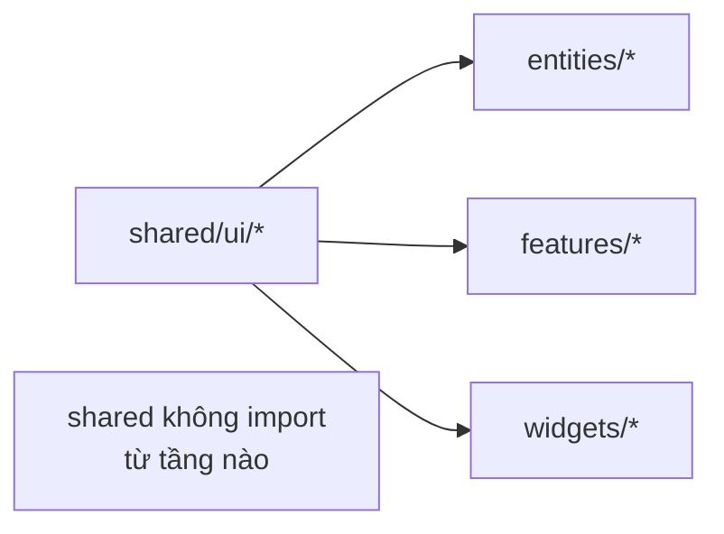

# Tầng Shared — OmiLearn

> Tầng nền tảng của hệ thống — chứa các UI primitives và utilities dùng chung, không phụ thuộc bất kỳ tầng nào khác.

---

## 1. Tổng quan

```
shared/
├── ui/
│   ├── AIStreamText.tsx
│   ├── Badge.tsx
│   ├── IconButton.tsx
│   ├── PageTransition.tsx
│   ├── ProgressBar.tsx
│   └── index.ts
└── lib/
    └── (store utilities)
```

> [!IMPORTANT]
> `shared/` **không được** import từ bất kỳ tầng nào khác. Đây là quy tắc cứng trong FSD.

---

## 2. Component: `AIStreamText`

### 2.1 Mục đích

Hiển thị text với hiệu ứng typing từng ký tự — mô phỏng AI đang trả lời. Được dùng rộng rãi nhất trong hệ thống.

### 2.2 Props interface

```typescript
interface Props {
  text: string;           // Nội dung cần stream
  speed?: number;         // ms/ký tự, mặc định: 20
  onComplete?: () => void; // Callback khi stream xong
  className?: string;
  startDelay?: number;    // ms trước khi bắt đầu, mặc định: 0
}
```

### 2.3 Behavior chi tiết

- **Tốc độ thay đổi linh hoạt** để tạo cảm giác tự nhiên:
  - Ký tự thường: `speed + random * speed * 0.5`
  - Dấu phẩy `,`: `speed × 3`
  - Dấu câu `.!?`: `speed × 5`
  - Xuống dòng `\n`: `speed × 8`
- **Render Markdown bold** — `**text**` → `<strong>text</strong>`
- **Cursor nhấp nháy** khi đang stream: `▋` với `animate-pulse`
- **Reset hoàn toàn** khi `text` prop thay đổi

### 2.4 Ví dụ sử dụng

```typescript
import { AIStreamText } from '@/shared/ui/AIStreamText';

// Cơ bản
<AIStreamText text="Xin chào! Tôi là trợ lý AI." speed={20} />

// Với callback và delay
<AIStreamText
  text={responseText}
  speed={16}
  startDelay={300}
  onComplete={() => setIsStreaming(false)}
  className="text-sm text-[#2D2D2D]"
/>
```

### 2.5 Nơi được dùng

- `features/create-project` — AI preview khi tạo dự án
- `features/plan-survey` — Stream kế hoạch học tập
- `features/node-review` — AI feedback cho Essay và Teach AI
- `features/node-ai-chat` — AI response trong chat
- `widgets/infinite-canvas` — AI summary trong expanded nodes

---

## 3. Component: `Badge`

### 3.1 Mục đích

Badge/tag nhỏ inline cho labels, status indicators, category tags.

### 3.2 Props interface

```typescript
interface Props {
  children: React.ReactNode;
  style?: React.CSSProperties;
  className?: string;
}
```

### 3.3 Ví dụ sử dụng

```typescript
import Badge from '@/shared/ui/Badge';

<Badge className="bg-[#EEF2FF] text-[#4338CA]">
  B2B
</Badge>

<Badge style={{ backgroundColor: '#4CD964', color: '#fff' }}>
  ✓ Hoàn thành
</Badge>
```

---

## 4. Component: `IconButton`

### 4.1 Mục đích

Button với icon, có micro-animation hover/tap (Framer Motion `whileHover` + `whileTap`).

### 4.2 Props interface

```typescript
interface Props {
  icon: React.ReactNode;    // Lucide icon hoặc bất kỳ ReactNode
  onClick: () => void;
  title?: string;           // Tooltip text
  className?: string;
  style?: React.CSSProperties;
  disabled?: boolean;
}
```

### 4.3 Ví dụ sử dụng

```typescript
import IconButton from '@/shared/ui/IconButton';
import { ZoomIn } from 'lucide-react';

<IconButton
  icon={<ZoomIn size={16} />}
  onClick={zoomIn}
  title="Phóng to"
  className="w-8 h-8 rounded-lg bg-white border border-[#E5E5DF]"
/>
```

---

## 5. Component: `PageTransition`

### 5.1 Mục đích

Wrapper tạo fade+slide animation khi navigate giữa các pages trong Next.js App Router.

### 5.2 Props interface

```typescript
interface Props {
  children: React.ReactNode;
}
```

### 5.3 Animation

- **Initial:** `{ opacity: 0, y: 8 }`
- **Animate:** `{ opacity: 1, y: 0 }`
- **Duration:** 300ms, easing: `easeOut`
- **Key:** `pathname` — trigger animation mỗi khi route thay đổi

### 5.4 Ví dụ sử dụng

```typescript
import PageTransition from '@/shared/ui/PageTransition';

// Trong layout hoặc page
export default function Layout({ children }) {
  return (
    <PageTransition>
      {children}
    </PageTransition>
  );
}
```

---

## 6. Component: `ProgressBar`

### 6.1 Mục đích

Progress bar ngang với animated fill — dùng trong StatCard và màn hình loading.

### 6.2 Props interface

```typescript
interface Props {
  value: number;        // 0–100
  color?: string;       // Hex, mặc định: '#4CD964'
  height?: number;      // px, mặc định: 8
  delay?: number;       // Animation delay (giây), mặc định: 0
  className?: string;
}
```

### 6.3 Animation

Framer Motion animate từ `width: 0` đến `width: ${value}%`:
- **Duration:** 0.9s
- **Easing:** `easeOut`
- **Delay:** configurable (dùng cho stagger effect trong StatGrid)

### 6.4 Ví dụ sử dụng

```typescript
import ProgressBar from '@/shared/ui/ProgressBar';

// Trong StatCard
<ProgressBar
  value={stat.percentage}
  color={stat.color}
  height={8}
  delay={0.5 + index * 0.1}
/>

// Progress bar đơn giản
<ProgressBar value={65} color="#818CF8" />
```

---

## 7. Tóm tắt dependencies



| Component | Dùng bởi |
|-----------|---------|
| `AIStreamText` | create-project, plan-survey, node-review, node-ai-chat, infinite-canvas |
| `Badge` | dashboard/ui, landing-page |
| `IconButton` | infinite-canvas (ZoomControls), header |
| `PageTransition` | app/(main)/layout |
| `ProgressBar` | entities/dashboard/ui/StatCard |
