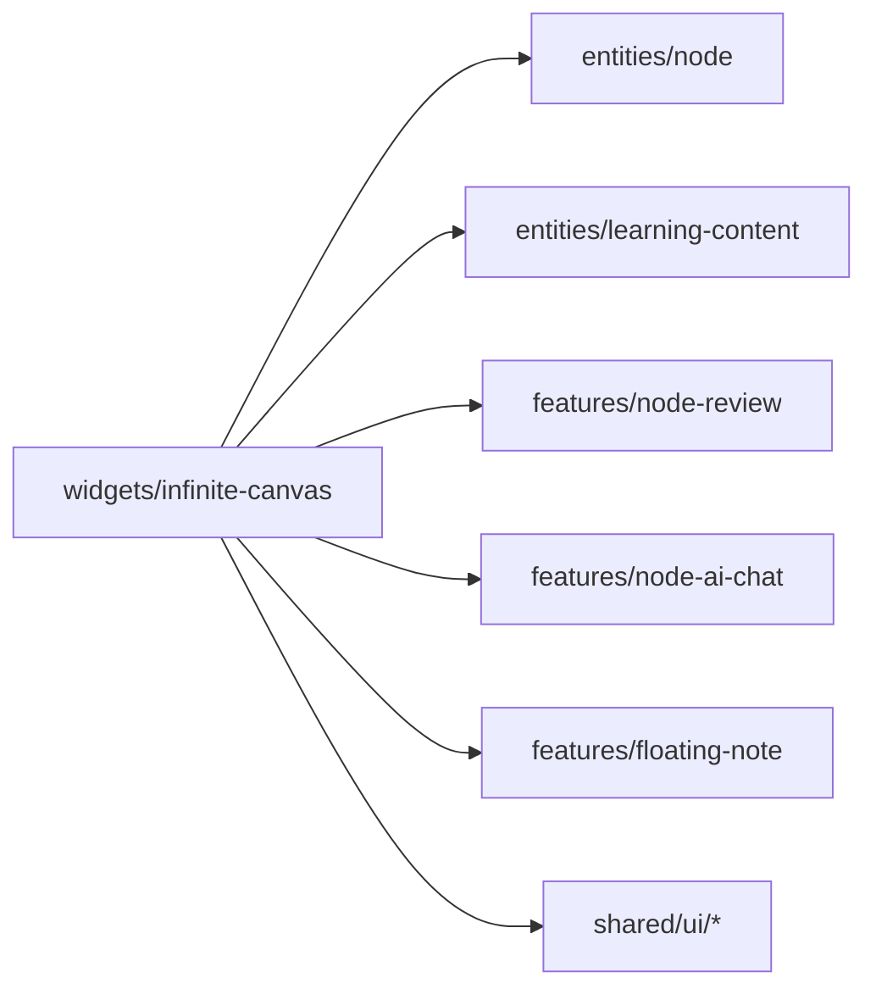

# Tầng Widgets — OmiLearn

> Tầng Widgets chứa các composite blocks — UI phức tạp được lắp ghép từ entities và features. Đây là tầng gần với App nhất.

---

## 1. Tổng quan

| Widget | Mô tả | Components |
|--------|-------|-----------|
| `infinite-canvas` | Canvas vô hạn, trái tim của ứng dụng | 21 UI + 3 hooks |
| `chat-box` | Chat nhóm real-time (B2B mode) | 6 components |
| `project-dashboard` | Thống kê tiến độ, lịch học | 5 components |
| `header` | Top navigation bar | 1 component |
| `footer` | Footer navigation | 1 component |
| `landing-page` | Trang giới thiệu sản phẩm | 13 components |
| `roadmap-graph` | Graph lộ trình học tập | 1 component |

---

## 2. Widget: `infinite-canvas`

### 2.1 Mục đích

Widget lớn nhất và phức tạp nhất — không gian làm việc vô hạn cho phép người học tổ chức kiến thức dưới dạng bản đồ tư duy tương tác.

### 2.2 Component tree

```
InfiniteCanvas (core)
├── CanvasNode (từ entities/node)
├── EdgeLayer (CanvasEdge.tsx)
├── ZoomControls
├── ZoomIndicator
├── CanvasHint
├── ContextMenu
│   └── ContextMenuItem
├── AddUnitMenu
├── SelectionToolbar
├── SplitView (expanded node overlay)
│   ├── DocumentSidebar
│   ├── ExpandedNodeView
│   │   ├── ExpandedHeader
│   │   ├── ExpandedDocContent
│   │   │   └── DocFooterActions
│   │   │       └── VideoPlayer
│   │   ├── ExpandedAIContent → NodeAIChat (features)
│   │   ├── ExpandedNoteContent
│   │   └── ExpandedSynthesisContent
│   └── NodeReview (features) — tab ôn tập
└── FloatingNote (features)
```

### 2.3 Custom Hooks

#### `useCanvasNodes`

Quản lý state nodes và edges, collapse/expand logic.

```typescript
// widgets/infinite-canvas/lib/useCanvasNodes.ts

export function useCanvasNodes(
  initialNodes: CanvasNode[],
  initialEdges: CanvasEdge[],
): {
  nodes: CanvasNode[];
  setNodes: React.Dispatch<React.SetStateAction<CanvasNode[]>>;
  edges: CanvasEdge[];
  setEdges: React.Dispatch<React.SetStateAction<CanvasEdge[]>>;
  collapsedNodeIds: Set<string>;
  genId: () => string;
  getAllDescendantIds: (nodeId: string) => string[];
  isNodeHidden: (nodeId: string) => boolean;
  hasChildren: (nodeId: string) => boolean;
  toggleCollapse: (nodeId: string) => void;
  deleteNode: (nodeId: string) => void;
  addNode: (node: CanvasNode) => void;
  addEdge: (edge: CanvasEdge) => void;
}
```

**Thuật toán `getAllDescendantIds`:**
BFS traversal qua `parentId` — tìm tất cả con cháu của một node.

**Thuật toán `isNodeHidden`:**
Đi ngược lên parent chain — nếu bất kỳ ancestor nào bị collapse thì node bị ẩn.

#### `useCanvasTransform`

Quản lý pan và zoom của canvas.

```typescript
// widgets/infinite-canvas/lib/useCanvasTransform.ts

export function useCanvasTransform(
  containerRef: React.RefObject<HTMLDivElement | null>,
): {
  transform: Transform;       // { x, y, scale }
  transformRef: React.RefObject<Transform>;
  isPanning: React.RefObject<boolean>;
  handleMouseDown: (e: React.MouseEvent) => void;
  handleMouseMove: (e: React.MouseEvent) => void;
  handleMouseUp: () => void;
  zoomIn: () => void;
  zoomOut: () => void;
  resetView: () => void;
}
```

**Pan behavior:** Click và drag trên vùng canvas trống (không phải node).

**Zoom behavior:** Mouse wheel — scale range: `[0.3, 2.5]`, step: `×0.92` (zoom out) / `×1.08` (zoom in).

#### `useNodeDrag`

Xử lý kéo thả node trên canvas.

```typescript
// widgets/infinite-canvas/lib/useNodeDrag.ts

export function useNodeDrag(
  setNodes: React.Dispatch<React.SetStateAction<CanvasNode[]>>,
): {
  handleNodeDrag: (id: string, dx: number, dy: number) => void;
}
```

**Behavior:** Cộng `dx/scale` và `dy/scale` vào tọa độ node — normalize theo zoom scale hiện tại.

### 2.4 Types (widget-specific)

```typescript
// widgets/infinite-canvas/model/types.ts

// Re-exports từ entities/node
export type { CanvasNode, CanvasEdge } from '@/entities/node/model/types';
export { NODE_STYLES, EDGE_COLORS } from '@/entities/node/model/types';

// Widget-specific UI state
export interface ContextMenuState {
  x: number;
  y: number;
  canvasX?: number;
  canvasY?: number;
  nodeId?: string;
  nodeType?: string;
  hasChildren?: boolean;
  isCollapsed?: boolean;
}

export interface SelectionToolbarState {
  x: number;
  y: number;
  text: string;
  sourceNodeId: string;
}

export interface ContentNodeUI {
  id: string;
  label: string;
  icon: string;
  color: string;
  border: string;
  docId: string;
}

export interface Transform {
  x: number;
  y: number;
  scale: number;
}
```

### 2.5 Constants

```typescript
// widgets/infinite-canvas/model/constants.ts
export const CANVAS_W = 3000;
export const CANVAS_H = 2400;
```

### 2.6 Props của `InfiniteCanvas` (core)

```typescript
interface Props {
  unitId?: string;       // Khi load canvas cho unit cụ thể
  projectId?: string;
  onNodeClickForSidebar?: (nodeId: string, canvasNodeId: string) => void;
  onOpenDocument?: (docId: string, nodeId: string) => void;
}
```

### 2.7 Layout builders

Hai hàm build layout được export từ `InfiniteCanvas.tsx`:

```typescript
// Khi load canvas cho một unit cụ thể
export function buildUnitLayout(unitId: string): {
  nodes: CanvasNode[];
  edges: CanvasEdge[];
}

// Khi load canvas mặc định (toàn bộ khóa học)
export function buildInitialNodes(): {
  nodes: CanvasNode[];
  edges: CanvasEdge[];
}
```

### 2.8 Interaction patterns

| Hành động | Kết quả |
|-----------|---------|
| Click vùng canvas trống + drag | Pan canvas |
| Mouse wheel | Zoom in/out (0.3x – 2.5x) |
| Click node | Focus node (highlight) |
| Double-click node | Mở ExpandedNodeView |
| Right-click node | Hiện ContextMenu |
| Drag node | Di chuyển node |
| ContextMenu → Collapse/Expand | Ẩn/hiện sub-tree |
| Chọn text | Hiện SelectionToolbar (AI action) |
| ContextMenu → Thêm đơn vị | Hiện AddUnitMenu |

### 2.9 Entity & Feature dependencies



---

## 3. Widget: `chat-box`

### 3.1 Mục đích

Chat nhóm real-time nổi ở góc dưới phải. Hỗ trợ B2B mode với danh sách thành viên và invite.

### 3.2 Component tree

```
ChatBox
├── ChatToggleButton  — nút mở/đóng (có badge số tin chưa đọc)
├── ChatMessage       — render từng tin nhắn
├── ChatInput         — input + send
├── MemberList        — danh sách thành viên (B2B)
└── InviteModal       — modal mời thành viên mới
```

### 3.3 Props

```typescript
interface Props {
  isB2B?: boolean;  // default: false — bật mode nhóm học
}
```

### 3.4 Internal state

```typescript
const [open, setOpen] = useState(false);
const [messages, setMessages] = useState(groupChatMessages);
const [input, setInput] = useState('');
const [badge, setBadge] = useState(2);     // Số tin chưa đọc
const [showInvite, setShowInvite] = useState(false);
```

### 3.5 Entity dependencies

```typescript
import { groupChatMessages } from '@/entities/learning-content';
import { projectMembers } from '@/entities/project';
```

### 3.6 Interaction patterns

| Hành động | Kết quả |
|-----------|---------|
| Click toggle button | Mở/đóng chat panel |
| Gửi tin nhắn | Thêm vào messages với `isMe: true` |
| B2B mode | Hiển thị avatar members + nút UserPlus |
| Click UserPlus | Mở InviteModal |

---

## 4. Widget: `project-dashboard`

### 4.1 Mục đích

Dashboard chi tiết của một project: thống kê học tập, lịch tuần, danh sách phiên học sắp tới.

### 4.2 Component tree

```
ProjectDashboard (app page level)
├── Breadcrumb          — "Dashboard / Hệ Điều Hành"
├── StatGrid            — Grid 2x2 các thống kê
│   └── StatCard        — Card với ProgressBar (từ entities/dashboard)
├── CircularProgress    — Tiến độ tổng thể (từ entities/dashboard)
├── WeekCalendar        — Lịch tuần với highlight ngày học
├── SessionList         — Danh sách phiên học sắp tới
│   └── SessionCard     — Card phiên học (từ entities/dashboard)
└── AnalysisPanel       — Biểu đồ phân tích kỹ năng
```

### 4.3 StatGrid props

```typescript
interface Props {
  stats: DashboardStat[];
}
```

### 4.4 Breadcrumb props

```typescript
interface Props {
  projectTitle: string;
  projectId: string;
}
```

### 4.5 Entity dependencies

```typescript
import { DashboardStat, StudySession } from '@/entities/dashboard';
import { dashboardStats, upcomingStudySessions } from '@/entities/dashboard';
import StatCard from '@/entities/dashboard/ui/StatCard';
import CircularProgress from '@/entities/dashboard/ui/CircularProgress';
import SessionCard from '@/entities/dashboard/ui/SessionCard';
```

---

## 5. Widget: `header`

### 5.1 Mục đích

Top navigation bar hiển thị ở tất cả routes trong `(main)` layout.

### 5.2 Component: `TopNavBar`

**Sub-components (inline):**
- Logo + tên dự án hiện tại
- Navigation links: `/` · `/learn` · `/roadmap` · `/dashboard` · `/schedule` · `/workspace`
- Nút tạo dự án mới → trigger `openCreateModal()`
- Avatar người dùng

**Entity dependencies:**
```typescript
import { useOmiLearnStore } from '@/entities/project';
```

---

## 6. Widget: `footer`

### 6.1 Mục đích

Footer đơn giản — copyright và quick links.

### 6.2 Component: `Footer`

Không có props. Static content.

---

## 7. Widget: `landing-page`

### 7.1 Mục đích

Trang giới thiệu sản phẩm đầy đủ — Hero, Features, Pricing, FAQ, Testimonials.

### 7.2 Component tree

```
LandingPage (app/landing/page.tsx)
├── LandingNav         — Navigation bar landing
├── HeroSection        — Hero với headline + CTA
│   └── CTAButton
├── ManifestoLine      — Tagline nổi bật
├── InteractiveDemo    — Demo tương tác mini canvas
├── StatItem           — Số liệu (x users, y...)
├── FeatureCard        — Card tính năng (x6)
├── ComparisonTable    — So sánh với đối thủ
├── PricingCard        — Card giá (x3 tiers)
├── TestimonialCard    — Nhận xét người dùng
├── FAQItem            — Câu hỏi thường gặp
├── FooterCTA          — CTA cuối trang
└── LandingFooter      — Footer landing
```

### 7.3 Key components

#### `CTAButton`
```typescript
interface Props {
  children: React.ReactNode;
  href?: string;
  variant?: 'primary' | 'secondary';
}
```

#### `FeatureCard`
```typescript
interface Props {
  icon: string;
  title: string;
  description: string;
}
```

#### `PricingCard`
```typescript
interface Props {
  tier: string;
  price: string;
  features: string[];
  highlighted?: boolean;
}
```

---

## 8. Widget: `roadmap-graph`

### 8.1 Mục đích

Visualize lộ trình học tập dạng directed graph sử dụng `@xyflow/react`.

### 8.2 Component: `RoadmapGraph`

**Entity dependencies:**
```typescript
import { defaultRoadmapNodes, defaultRoadmapEdges } from '@/entities/node';
```

### 8.3 Interaction patterns

| Hành động | Kết quả |
|-----------|---------|
| Click node | Highlight node, hiện detail |
| Drag node | Di chuyển node trên graph |
| Scroll | Zoom in/out |
| Click edge | (không có action) |

> [!NOTE]
> `roadmap-graph` dùng `@xyflow/react` (React Flow) trong khi `infinite-canvas` dùng canvas thuần custom. Hai cách tiếp cận khác nhau cho hai use case khác nhau.
