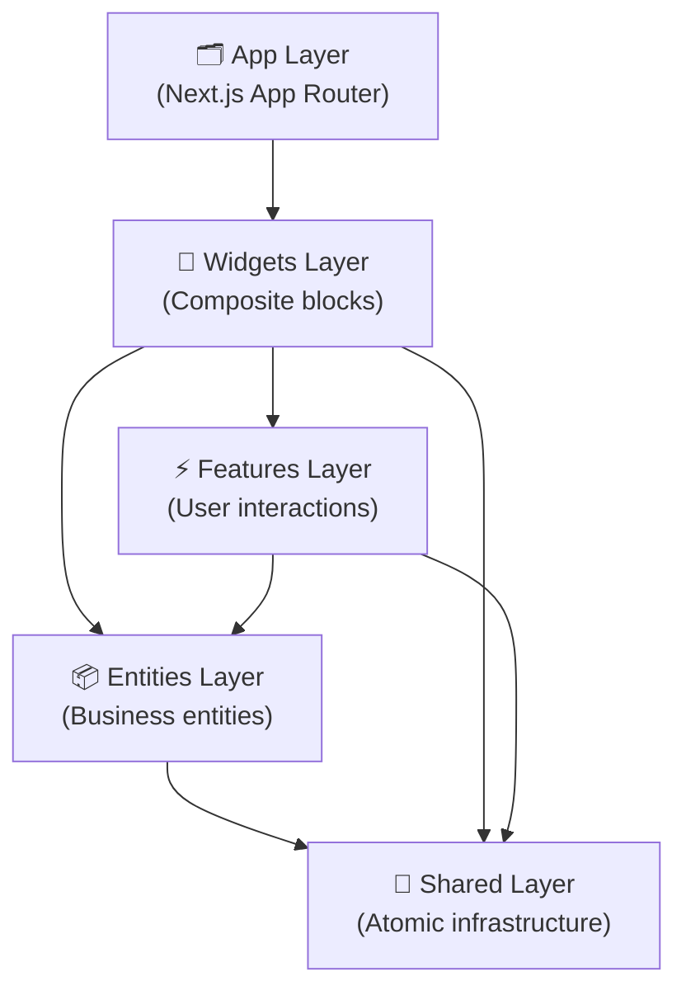

# Tổng quan hệ thống — OmiLearn

> Tài liệu tổng quan về kiến trúc, tính năng, tech stack và cấu trúc dự án OmiLearn.

---

## 1. Giới thiệu

OmiLearn là nền tảng học tập thông minh dành cho sinh viên Việt Nam. Điểm đặc trưng là **Infinite Canvas** — không gian làm việc vô hạn cho phép người học tổ chức kiến thức dưới dạng bản đồ tư duy tương tác, kết hợp với **AI Chat** tích hợp theo từng node tài liệu.

Hệ thống được xây dựng theo kiến trúc **Feature-Sliced Design (FSD)** với Next.js 16 App Router, đảm bảo phân tách rõ ràng giữa các tầng và dễ mở rộng.

## 2. Thông tin dự án

| Thuộc tính | Giá trị |
|-----------|---------|
| **Tên dự án** | OmiLearn |
| **Phiên bản** | 0.1.0 |
| **Framework** | Next.js 16.2.1 (App Router) |
| **React** | 19.2.4 |
| **TypeScript** | 5.x |
| **Tailwind CSS** | 4.x |
| **State Management** | Zustand 5.0.12 |
| **Animation** | Framer Motion 12.38.0 |
| **Icons** | Lucide React 0.577.0 |
| **Graph** | @xyflow/react 12.10.1 |
| **Architecture** | Feature-Sliced Design (FSD) |
| **Ngôn ngữ docs** | Tiếng Việt |

## 3. Tầm nhìn & Mục tiêu

OmiLearn hướng đến việc thay đổi cách sinh viên Việt Nam học tập:

- **Tổ chức kiến thức trực quan** — Thay vì học tuyến tính, người dùng xây dựng bản đồ kiến thức tương tác
- **AI là đồng hành** — Không phải công cụ tìm kiếm, mà là trợ lý hiểu ngữ cảnh tài liệu
- **Học sâu hơn** — 4 chế độ ôn tập (Quiz, Flashcard, Essay, Dạy lại AI) giúp củng cố kiến thức lâu dài
- **Cộng tác nhóm** — Chat real-time, chia sẻ khóa học, quản lý thành viên (B2B mode)

## 4. Kiến trúc hệ thống



> [!IMPORTANT]
> Import chỉ đi theo chiều **xuống** (từ tầng cao đến tầng thấp). Không được cross-import cùng tầng.

## 5. Tính năng cốt lõi

| Tính năng | Mô tả | Trạng thái |
|-----------|-------|-----------|
| **Infinite Canvas** | Không gian làm việc vô hạn, kéo thả, zoom, pan nodes | ✅ Hoàn chỉnh |
| **AI Chat** | Chat với AI trong ngữ cảnh từng tài liệu | ✅ Hoàn chỉnh |
| **Node Review** | Quiz, Flashcard, Essay, Dạy lại AI | ✅ Hoàn chỉnh |
| **Create Project** | Wizard 3 bước tạo dự án với AI tìm tài liệu | ✅ Hoàn chỉnh |
| **Plan Survey** | Khảo sát 4 câu → AI tạo kế hoạch học 8 tuần | ✅ Hoàn chỉnh |
| **Roadmap Graph** | Lộ trình học dạng graph có hướng | ✅ Hoàn chỉnh |
| **Dashboard** | Thống kê tiến độ, lịch học hàng tuần | ✅ Hoàn chỉnh |
| **Chat Box** | Chat nhóm real-time (B2B mode) | ✅ Hoàn chỉnh |
| **Landing Page** | Trang giới thiệu sản phẩm đầy đủ | ✅ Hoàn chỉnh |
| **Floating Note** | Ghi chú nổi với mẹo sử dụng | ✅ Hoàn chỉnh |

## 6. Tech Stack

| Lớp | Công nghệ | Phiên bản |
|-----|-----------|----------|
| **Framework** | Next.js (App Router) | 16.2.1 |
| **UI Library** | React | 19.2.4 |
| **Language** | TypeScript | 5.x |
| **Styling** | Tailwind CSS | 4.x |
| **Animation** | Framer Motion | 12.38.0 |
| **State** | Zustand | 5.0.12 |
| **Icons** | Lucide React | 0.577.0 |
| **Graph** | @xyflow/react | 12.10.1 |
| **Build** | Turbopack (Next.js built-in) | — |

## 7. Kiến trúc FSD chi tiết

```mermaid
flowchart LR
    subgraph APP["App Layer (8 routes)"]
        R1["/"] 
        R2["/learn"]
        R3["/dashboard"]
        R4["/roadmap"]
        R5["/schedule"]
        R6["/workspace"]
        R7["/landing"]
    end

    subgraph WIDGETS["Widgets (7 slices)"]
        W1[infinite-canvas]
        W2[chat-box]
        W3[project-dashboard]
        W4[header]
        W5[footer]
        W6[landing-page]
        W7[roadmap-graph]
    end

    subgraph FEATURES["Features (5 slices)"]
        F1[create-project]
        F2[plan-survey]
        F3[node-review]
        F4[node-ai-chat]
        F5[floating-note]
    end

    subgraph ENTITIES["Entities (5 slices)"]
        E1[project]
        E2[node]
        E3[dashboard]
        E4[learning-content]
        E5[session]
    end

    subgraph SHARED["Shared"]
        S1[ui/]
        S2[lib/]
    end

    APP --> WIDGETS
    WIDGETS --> FEATURES
    FEATURES --> ENTITIES
    ENTITIES --> SHARED
```



## 8. Quy tắc Import

| Tầng | Được import từ | Không được import |
|------|---------------|-----------------|
| `app/` | `widgets/`, `features/`, `entities/`, `shared/` | — |
| `widgets/` | `features/`, `entities/`, `shared/` | `app/` |
| `features/` | `entities/`, `shared/` | `app/`, `widgets/` |
| `entities/` | `shared/` | `app/`, `widgets/`, `features/` |
| `shared/` | — | Tất cả tầng trên |

> [!WARNING]
> Vi phạm quy tắc import sẽ tạo circular dependency và phá vỡ tính modular của FSD.

Alias import được cấu hình trong `tsconfig.json`:
```json
{
  "paths": {
    "@/*": ["./*"]
  }
}
```

Ví dụ import hợp lệ:
```typescript
// Trong widgets/infinite-canvas/ui/InfiniteCanvas.tsx
import { mindmapNodes } from '@/entities/learning-content';
import { CanvasNode } from '@/entities/node/model/types';
import { AIStreamText } from '@/shared/ui/AIStreamText';
```

## 9. Thống kê file

| Lớp | Số files | Ghi chú |
|-----|---------|---------|
| `entities/` | 21 files | 5 slices × types + mock + UI |
| `features/` | 8 files | 5 slices × UI components |
| `widgets/` | ~58 files | 7 slices, infinite-canvas lớn nhất |
| `shared/` | 7 files | 5 UI components + 1 lib + index |
| `app/` (pages) | 9 files | 8 routes + layout |
| **Tổng** | **~94 files** | TypeScript/TSX |

> [!NOTE]
> Widget `infinite-canvas` là slice lớn nhất với 21 UI components, 3 custom hooks, và 2 model files.
